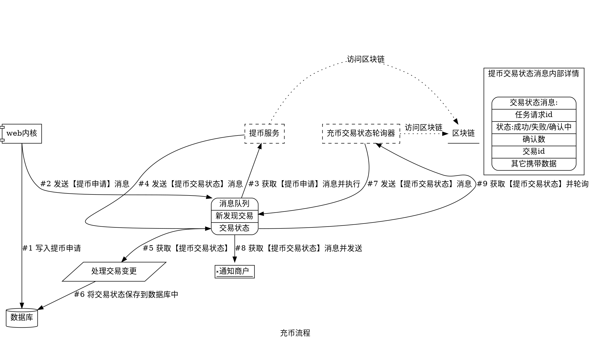

```graphviz
digraph deposit_flow_graph {
    label = "充币流程"

    core [shape="component" label="web内核"]
    database[shape="cylinder" label="数据库"]
    mq [shape="Mrecord" label="{消息队列|新发现交易|<tx_status>交易状态}"]
    withdraw_worker [shape="rect" style="dashed" label="提币服务"]
    tx_worker [shape="parallelogram" label="处理交易变更"]
    poll_worker [shape="rect" style="dashed" label="充币交易状态轮询器"]
    notifier_worker [shape="signature" label="通知商户"]
    blockchain [shape="underline" label="区块链"]

    core -> database [label="#1 写入提币申请"]
    core -> mq:withdraw_task [label="#2 发送【提币申请】消息"]
    mq:withdraw_task -> withdraw_worker [label="#3 获取【提币申请】消息并执行"]
    withdraw_worker -> mq:tx_status [label="#4 发送【提币交易状态】消息"]
    mq:tx_status -> tx_worker [label="#5 获取【提币交易状态】"]
    tx_worker -> database [label="#6 将交易状态保存到数据库中"]
    poll_worker -> mq [label="#7 发送【提币交易状态】消息"]
    mq:tx_status -> notifier_worker [label="#8 获取【提币交易状态】消息并发送"]
    mq:tx_status -> poll_worker [label="#9 获取【提币交易状态】并轮询"]


    withdraw_worker, poll_worker -> blockchain [label="访问区块链" style="dotted"]


    subgraph cluster_tx {
        label = "提币交易状态消息内部详情"
 
        // tx_message [shape="egg" label="交易状态消息"]
        // tx_message_request_id [shape="egg" label="任务请求id"]
        // tx_message_status [shape="egg" label="状态:成功/失败/确认中"]
        // tx_message_confirm [shape="egg" label="确认数"]
        // tx_message_tx [shape="egg" label="交易id"]
        // tx_message_payload [shape="egg" label="其它携带数据"]
        // tx_message -> {tx_message_request_id, tx_message_status, tx_message_confirm, tx_message_tx, tx_message_payload} [label="包含" style="dotted"]

        tx_message [shape="Mrecord" label="{交易状态消息:|任务请求id|状态:成功/失败/确认中|确认数|交易id|其它携带数据}"]
    }
    
    { rank=min; poll_worker; withdraw_worker; blockchain;}
    // { rank=min; core; tx_worker;}
}
```

